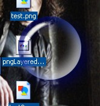



## Per Pixel Transparency for Your Forms

### Description

This project uses GDI+ to load a transparent .png and using UpdateLayeredwindows it displays the form using the png as the windows drawing source. Just try it, it's easier to see than describe.  This can easily create some of the nicest forms that you are able to make. No more regions no more combining and xor'ing, using this you have a perfect antialiased non-rectangular form that you can see whats underneath through it. It's like regions supercharged. Though this example is pretty simple, I haven't seen this done anywhere on the net. I found one example in C++ using an outside library to load the png but using GDI+ is easier.

I made this example without anything except the basic code to load the png and display the form. It's always been easier (for me) to see an example when there isn't anything extra to dig through. As far as I know, GDI+ comes with windows 2000 and XP which fortunately is also the only OS's that support UpdateLayeredwindows. Have fun with it. Comments and Votes welcome.
 
### More Info
 

             |
---                |---
**Submitted On**   |2004-08-02 14:53:30
**By**             |[Apeiron](https://github.com/Planet-Source-Code/PSCIndex/blob/master/ByAuthor/apeiron.md)
**Level**          |Intermediate
**User Rating**    |5.0 (114 globes from 23 users)
**Compatibility**  |VB 6\.0
**Category**       |[Graphics](https://github.com/Planet-Source-Code/PSCIndex/blob/master/ByCategory/graphics__1-46.md)
**World**          |[Visual Basic](https://github.com/Planet-Source-Code/PSCIndex/blob/master/ByWorld/visual-basic.md)
**Archive File**   |[Per\_Pixel\_177692822004\.zip](https://github.com/Planet-Source-Code/apeiron-per-pixel-transparency-for-your-forms__1-55313/archive/master.zip)

### API Declarations

Several

